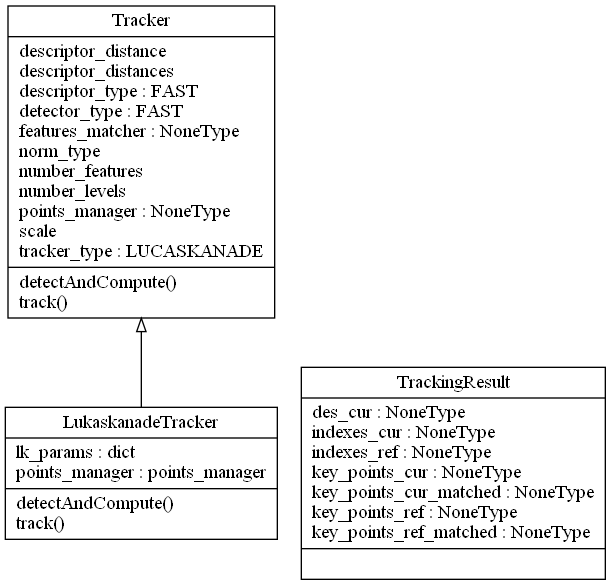
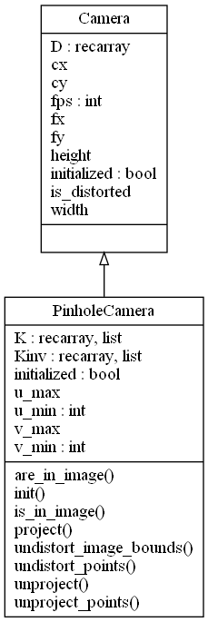
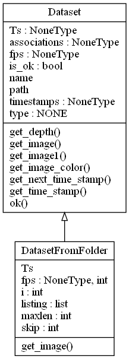
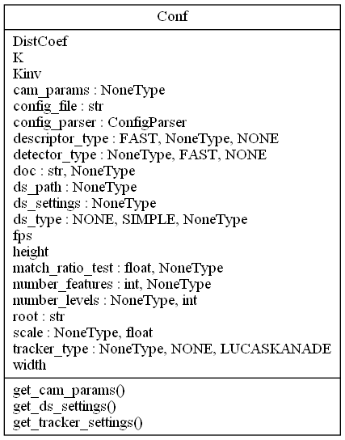
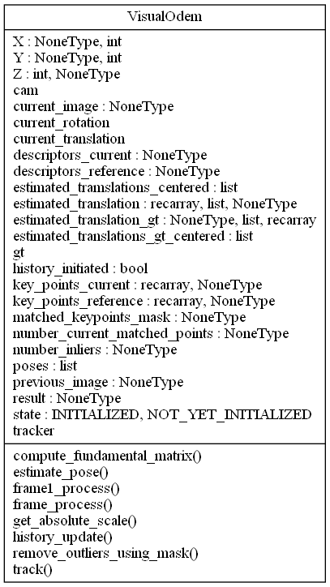

# Visual odometry project (the purpose is for fun)
python implementation of visual odometry. Lukas kande tracker has been used with FAST features. The interfaces design allows smothly new features and descriptors. using the corresponding pairs of points to estimate the camera pose with respect to the previous frame. 

# Usage

$ git clone --recursive  https://github.com/anasm87/visual_odometry.git

python3 ./main.py
 
**dependencies**:

* Python 3.6.9
* Numpy (1.18.2)
* OpenCV  
 

# UML design:

|  |    |
  |

|    |
  |
 

# datset:
kitti
